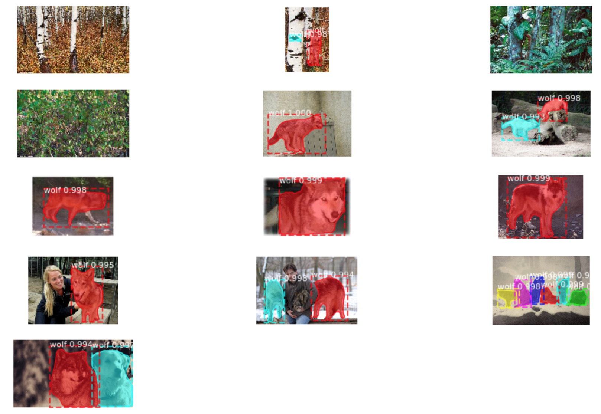
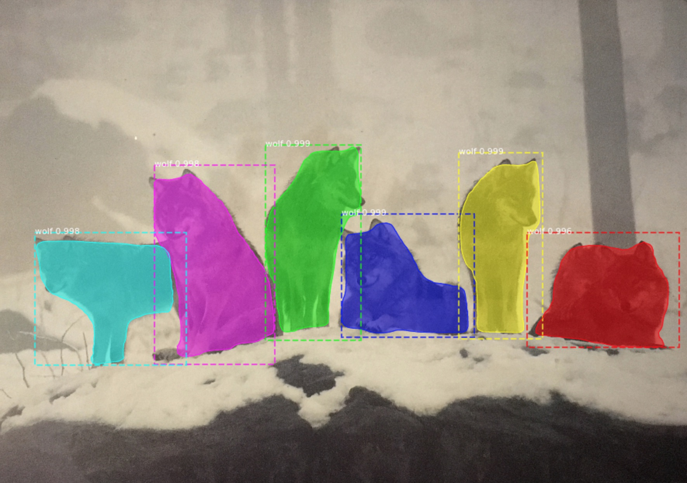

A class project for CSCI E89 that demonstrates single and multi-class instance segmentation using Mask R-CNN. 

This project leverage data from ImageNet (wolves, signs) as well as my own photos to train and test. The data was annotated using VGG Iamge Annotator.

Some definitions:

* Object classification - The identification of an object in a photo.
* Object detection -  Identification of one or more objects and their location. Specified with a bounding box.
* Instance segmentation - Detection of one or more objects of different classes, labeling each pixel with a category label. A Segment mask is generated for each instance.

 
## Dataset

Dataset consists of images download from ImageNet 
The images came in a variety of sizes and quality and were all RGB. 

The first data batch consistent of variety of wolf species. 
* Out of 1391 images only 171 images annotated.
* The total size of this data was 15M.

The second batch  consistent of traffic signs 
* Used to train the network to detect multiple traffic signs. 
* This batch consisted of 85 annotated images
* Total size was  26M

The VGG Image Annotator (VIA) was used to annotate the images. 

I leveraged the Mask RCNN framework and provided data

